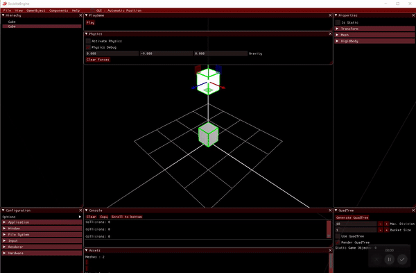

# Socialist Engine
3D Video Game Engine made with C++ & OpenGL

Welcome to the repository of Socialist Engine !

Socialist Engine is a Video Game Engine developed by 2 students from the Video Game Development & Design degree, at CITM (UPC).

Socialist engine is developed by:
  - Isaac Calvís [GitHub](https://github.com/isaaccalvis)
  - Aitor Velez [GitHub](https://github.com/AitorVelez)

## Main Core Sub-Systems

## Phyisics engine
We implemented colliders, rigidbodies and phyisics constrains ,these allows use to have the core parts of a phisics engine. In our engine you are able to test if two objects collide, apply gravity to them, and also apply a the collider component.
In this gif it' s possible to see two objetcs that have been previously applyied a rigidbody and a collider.

## Downloads & Release

[Source Code](https://github.com/isaaccalvis/Socialist_Engine)
[Releases](https://github.com/isaaccalvis/Socialist_Engine/releases)

## Controls

 - WASD: Navigation forward, backward and sides.
 - ER: Navigation up and down.
 - F: Center the camera in the selected object.
 - LeftAlt: Orbital camera around selected game object
 - Mouse Wheel: Zoom in, zoom out
 - Hold Shift: Camera moves x2 fast
 - Del: To delete selected Game Object

Guizmos

 - Q: Change between Local & Global Mode
 - W: Translate
 - E: Rotate
 - R: Scale

## Panels

 - Esc: Quit
 - F1: Shows configuration panel
 - F2: Shows  object propierties panel
 - F3: Shows console panel
 - F4: Shows hirearchy panel
 - F5: Shows QuadTree panel
 - F6: Shows PlayGame panel
 - F7: Shows Asset panel
 - F8: Shows Physics panel
 - F9: Shows the about panel
 
## Features

 - Drag&Drop 3D models & textures from your pc to the GameEngine, it will be added to the project at folder resources
 - Create & Delete GameObjects at Hierachy Panel
 - Create Primitives &/or add components to game objects (at top bar, gameobjects & components)
 - At configuration window can manage render & window options, also draw in wireframe mode or draw imported meshes normals, with a lot more features !
 - At properties panel you can modify selected GameObject transform, also see how many triangles have, or the texture associated at Material componentç
 - Create QuadTree with static GameObjects
 - Drag & Drop function at Hierachy Panel
 - Save/ Load Scenes

## Used Tools & libraries

Tools
  - Visual Studio 2017

Libraries
 - SDL
 - OpenGL
 - Glew
 - Assimp
 - DevIL
 - Imgui
 - MathGeoLib
 - Parson
 - MMGR
 - PCG Random
 - Par Shapes
 - PhysFS
 - ImGuizmo
 - BulletPhysics

## About our team

Socialist engine is developed by:
  - Isaac Calvís [GitHub](https://github.com/isaaccalvis)
  - Aitor Velez [GitHub](https://github.com/AitorVelez)

## License

Copyright <2019> <Socialist_Engine>

Permission is hereby granted, free of charge, to any person obtaining a copy of this software and associated documentation files (the "Software"), 
to deal in the Software without restriction, including without limitation the rights to use, copy, modify, merge, publish, distribute, sublicense,
and/or sell copies of the Software, and to permit persons to whom the Software is furnished to do so, subject to the following conditions:

The above copyright notice and this permission notice shall be included in all copies or substantial portions of the Software.

THE SOFTWARE IS PROVIDED "AS IS", WITHOUT WARRANTY OF ANY KIND, EXPRESS OR IMPLIED, INCLUDING BUT NOT LIMITED TO THE WARRANTIES OF MERCHANTABILITY, 
FITNESS FOR A PARTICULAR PURPOSE AND NONINFRINGEMENT. IN NO EVENT SHALL THE AUTHORS OR COPYRIGHT HOLDERS BE LIABLE FOR ANY CLAIM, DAMAGES OR OTHER 
LIABILITY, WHETHER IN AN ACTION OF CONTRACT, TORT OR OTHERWISE, ARISING FROM, OUT OF OR IN CONNECTION WITH THE SOFTWARE OR THE USE OR OTHER DEALINGS IN THE SOFTWARE.
